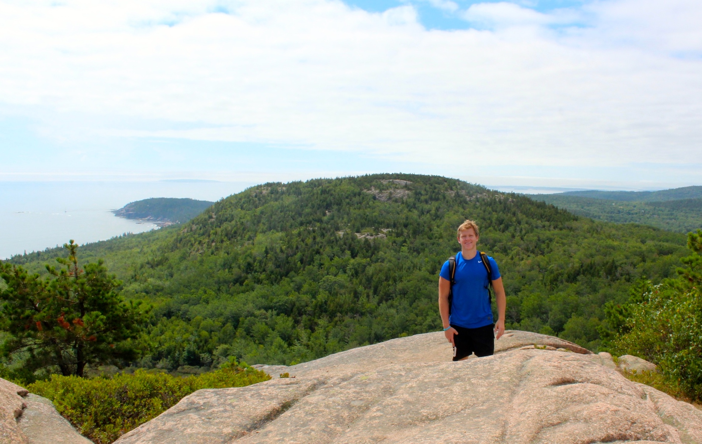
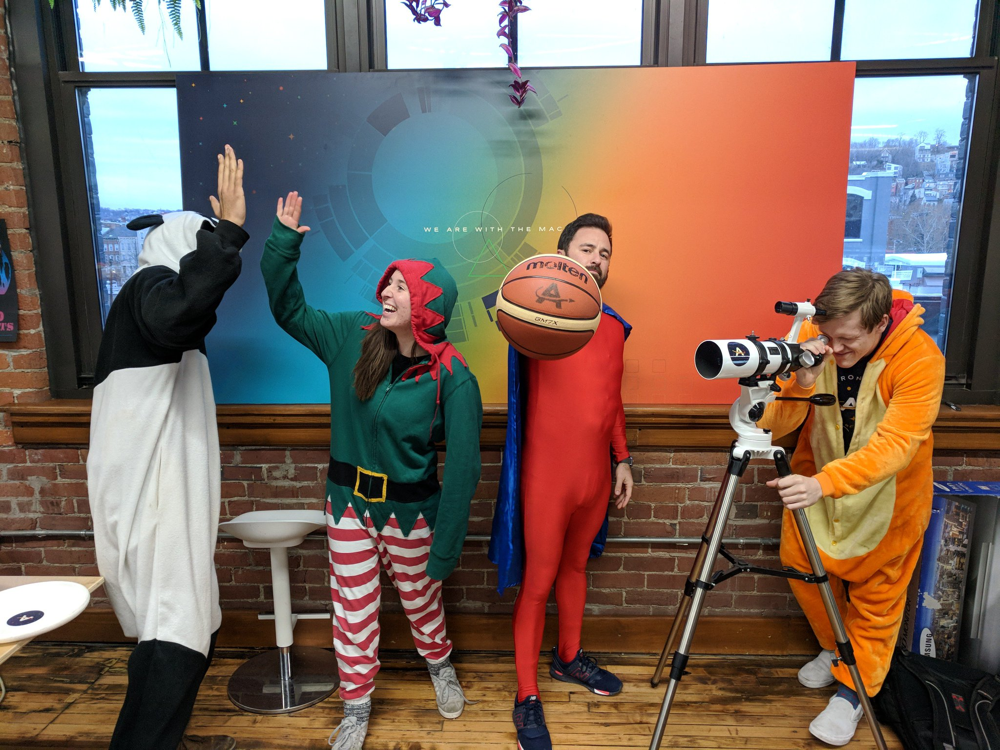

# About

Hi there! Thanks for checking out my site.

**A little about me:**

I currently work for a tech startup called [Astronomer](https://astronomer.io). We have a scrappy, determined, and kick ass team working our tails off to build a platform around [Apache Airflow](https://airflow.apache.org/). 

<!--  -->

I dove into a sales role out of college, but lately have found myself fascinated by all things software. I wear a lot of different hats, but these days my job most resembles that of a technical product manager- I write React, Node, and other various front-end code to make sure  our user experience is clean. I'm stoked about technical problem solving and look forward to getting deeper into engineering work.

I am a scientist by education, athlete by hobby, technologist by day, and musician by night. Early asprations of becoming a doctor found my academic focus on experimental science, but I changed my career trajectory about halfway through my college career when I had my first brushes with entrepreneurship.

I realized that building things gets me fired up.

The startup bug pushed me to pursue a fellowship with [Venture for America](https://ventureforamerica.org). VFA is an awesome organization that helps turn Wantrepreneur college kids into the real deal. The fellowship is the reason that I moved to Cincinnati after graduation with quite literally 0 ties to the Midwest.

More people should spend time in the Midwest.

In college, I played varsity football, helped run the Club Alpine Ski Team, studied Chemistry and Physics, played in a band, and took as many music theory classes as my schedule would allow. 

One of my friends once called me "The Chameleon" because I hung out with so many different groups on campus.

I am a New Yorker by birth, a Vermonter by childhood circumstance, a Mainer by education, and, currently, am a Cincinnatian by choice. I call myself "location-agnostic" with respect to my lifestyle and am a firm believer that adventure awaits everywhere.

<!-- {:.lead srcset="/assets/img/acadia.jpg 1920w, /assets/img/acadia.jpg 9x60w, /assets/img/acadia.jpg 480w" data-width="1920" data-height="1080"}
A shot from Acadia National Park in 2016.
{:.figure} -->

<!-- A little background on myself: I am a scientist by education, athlete by hobby, technologist by day, and musician by night. With early asprations of becoming a doctor, I studied Chemistry and Physics at Bowdoin College, but changed my career trajectory about halfway through my college career when I had my first brushes with entrepreneurship. While working at a solid-state lighting startup called [OLEDWorks](https://www.oledworks.com/), I fell in love with the nonstop action that comes with building an idea from the ground up. The idea of creating value for a group of people that would not otherwise exist without my efforts was extremely appealing to me. The startup bug led me to Venture for America, which is a fellowship program for college grads looking to learn about entrepreneurship while also making impact in local communities. While working with Venture for America, I had the opportunity to host 
I played on the Varisty Football team there, but spent my entire collegiate career battling a back injury and never got a chance to really get on the field. Thankfully, I was able to channel my extracurricular energy into the Club Ski Team.

I grew up in suburban New York, I currently live in Cincinnati and work at a tech startup called [Astronomer](https://astronomer.io) through a fellowship program called [Venture for America](https://ventureforamerica.org), and I think more people should spend time in the Midwest.

*[FLIP]: First-Last-Invert-Play. A coding technique to achieve performant page transition animations.
  -->