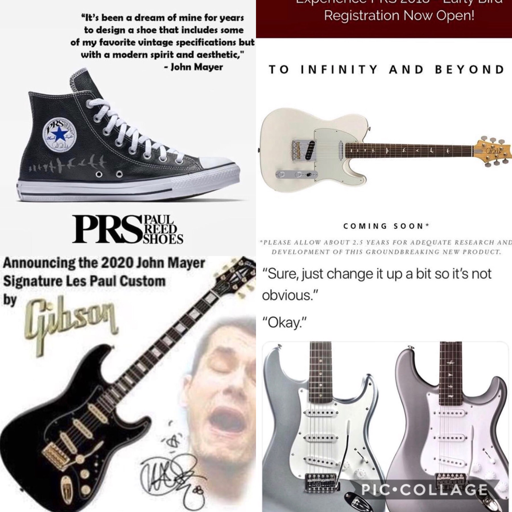

# Battle of the Brands: The PRS Silver Sky vs. the Fender Stratocaster 

## The Hype

PRS recently released the [John Mayer Silver Sky](http://www.prsguitars.com/electrics/bolton/silver_sky), a 63/64 Strat lookalike made according to John Mayer’s custom specs. The release of this axe has been heavily anticipated by guitarists and Mayer fans alike since Mayer teased his newest creation at a few shows earlier this year. On March 5th, the hype hit an all-time high as PRS officially announced production of the Silver Sky: 

"More than two and half years in the making, the Silver Sky is a vintage-inspired instrument that is at once familiar but also newly PRS through and through. This model was based off of Mayer and Smith’s favorite elements from 1963 and 1964 vintage instruments, resulting in an idealized version of a vintage single-coil guitar. The attention that was paid to every detail sets this guitar apart."

It hit the shelves for $2,299.00- quite a bit pricier than most modern American-made Strats but still in fair range for a luxury instrument, especially considering the [PRS reputation for consistently producing extremely high-quality guitars](https://spinditty.com/instruments-gear/Paul-Reed-Smith-Guitars-Luxury-Aint-Cheap). 

## The Hate

Since its release, the Silver Sky has lit online guitar communities on fire, pulling in criticism from pundits claiming that the Silver Sky is no more than Fender rip-off with some pretty fretboard inlays and Paul’s signature on the headstock. To be honest, when I first saw it, I fully bought into the criticism- it looks like a strat and sounds like a strat, so what’s the big deal? I got a pretty big kick out of some of the memes I saw cycling around various instagram accounts:

We’ll dive into the specs and do a full on-comparison in a minute. But first, some context.

## The Beef

In late 2014, John pulled away from Fender following a dispute in which Fender requested that he cover his non-fender amplifiers with fender-branded gear when playing live. [John has a pretty huge collection](http://equipboard.com/pros/john-mayer) of amps and regularly uses other gear, so it’s no surprise that he turned down Fender’s ask. Not honoring John’s pursuit of brand agnosticism, Fender insisted that he be exclusively loyal to their logo, further escalating the dispute. In order to maintain artistic integrity and give tonal credit where due, John pulled away from the Fender brand, [halting production of his signature Stratocaster](https://reverb.com/news/john-mayer-announces-split-with-fender). Fender took a lot of criticism for the incident; their pride forced them to forfeit representation from a generational guitarist.

## The Specs

Before I get to my opinions on the Silver Sky, let’s dive into the specs for all the hardware nerds out there (although if you’re a hardware nerd you almost certainly have seen these already):

<table>
  <tr>
    <td></td>
    <td>PRS Silver Sky</td>
    <td>Fender ‘64 Strat</td>
  </tr>
  <tr>
    <td>Body Wood</td>
    <td>Alder</td>
    <td>Premium Ash</td>
  </tr>
  <tr>
    <td>Frets</td>
    <td>22</td>
    <td>21</td>
  </tr>
  <tr>
    <td>Scale Length</td>
    <td>25.5</td>
    <td>25.5"</td>
  </tr>
  <tr>
    <td>Neck Wood</td>
    <td>Maple</td>
    <td>Maple</td>
  </tr>
  <tr>
    <td>Fretboard Wood</td>
    <td>Rosewood</td>
    <td>Rosewood</td>
  </tr>
  <tr>
    <td>Neck Shape</td>
    <td>635 JM (Custom)</td>
    <td>1965 Big "C” Shape</td>
  </tr>
  <tr>
    <td>Nut Width</td>
    <td>1.656”</td>
    <td>1.650”</td>
  </tr>
  <tr>
    <td>Fretboard Radius</td>
    <td>7.25”</td>
    <td>9.5”</td>
  </tr>
  <tr>
    <td>Nut</td>
    <td>Bone</td>
    <td>Bone</td>
  </tr>
  <tr>
    <td>Bridge</td>
    <td>Steel Tremolo</td>
    <td>American Vintage Synchronized Tremolo</td>
  </tr>
  <tr>
    <td>Tuners</td>
    <td>Vintage Style, Locking</td>
    <td>Vintage-Style</td>
  </tr>
  <tr>
    <td>Hardware Type</td>
    <td>Nickel</td>
    <td>Nickel/Chrome</td>
  </tr>
  <tr>
    <td>Bridge Pickup</td>
    <td>635 JM (Custom)</td>
    <td>Vintage Strat Single Coils</td>
  </tr>
  <tr>
    <td>Middle Pickup</td>
    <td>635 JM (Custom)</td>
    <td>Vintage Strat Single Coils</td>
  </tr>
  <tr>
    <td>Neck Pickup</td>
    <td>635 JM (Custom)</td>
    <td>Vintage Strat Single Coils</td>
  </tr>
  <tr>
    <td>Pickup Switching</td>
    <td>One Volume & Two Tones with a 5-Way Blade Pickup Switch</td>
    <td>One Volume & Two Tones with a 5-Way Blade Pickup Switch</td>
  </tr>
</table>

[PRS Source](https://www.reidys.com/pr/electric-guitars/prs-silver-sky-john-mayer-signature-frost-26185)

[1964 Strat Source](https://www.sweetwater.com/store/detail/StratRL64CSB--fender-custom-shop-limited-1964-stratocaster-relic)

While the overall specs are pretty similar (and the guitars look nearly identical), it’s worth pointing out that Paul’s JM custom pickups lend quite a different sound than your typical vintage Strat pickups. They’re single coil, but they’re designed such that some low end is added to the bridge pickup and some high end is added to the neck pickup. They’re designed to maintain the vintage Strat sound while making the treble more versatile; the high end isn’t quite as biting and the low end isn’t quite as rolled-back.

There are also a few key differences in the build that distinguish the guitar from the Strat. In order to give the guitar a modern look, John opted to re-shape the pickguard, extending it to reach lower on the guitar body. Then, in order to balance the appearance of the extended pickguard, he added some length to the top of the guitar and removed some mass from the cutaway. As a result, the cutaway maintains a bit of a different shape than that of a Strat (and is finished with some sexy sparkles). In order to compensate for the weight distribution of the new body, John opted for a 3x3 flipped PRS headstock that adds some substance to the guitar’s lower half.

## The Sway

So here’s where I’ll stray from contextual objectivity and give my two cents. At a first glance, I thought this guitar was ridiculous; to me, it felt very much like a manifestation of John’s grudge with Fender. To be completely honest, as an owner of both a PRS SE Custom and an American Strat, I was pretty torn up by it and wanted to hate on PRS for the rip-off.

Call me easily-influenced, but this video changed my mind completely:

[John Mayer live on Instagram discussing the Silver Sky](https://www.youtube.com/watch?v=-HqV2-e8818)

In it, Mayer dives into an articulate and honest explanation of the the guitar and squashes the public’s perception of any Fender beef.

"So, is it a strat with a PRS headstock?" Mayer asks, pointing out the new extended pickguard that seems to add a modern flare to the old Strat style. “No, and let me tell you why. When you take this much meat out of a Fender pickguard, it throws the whole thing off. You have to offset that with the right stuff.”

One piece of that "stuff" mentioned is the guitar’s color. According to John, “If the electric guitar had just come into prominence, you wouldn’t see a Sunburst. I don’t see Sunburst on other things; back in 1954 you saw Sunburst on cabinets, radios, televisions. You just don’t see Sunburst anymore.”

In order to transcend aesthetic antiquity and create a guitar that truly seems to be created in 2018, John opted to match [Tesla’s colors](https://www.tesla.com/) with the first line of Silver Skys. Here they are:

[Image Source](http://guitarvaultusa.com/news/prs-guitars-john-mayer-signature-model-silver-sky-now-available-for-pre-order/)

Above all, John honestly addressed the much-discussed controversy surrounding his relationship with Fender and his incentives for building this guitar with PRS. Apologies in advance for the huge block quote*, but these lines are what converted me from a Silver-Sky skeptic into a PRS phanatic (I ran out of alliterations, bear with me here): 

"By the way, let’s say the word Fender. The first thing I want you to understand is that I embrace the Fender thing...As a customer at heart, I want to see people play the Silver Sky through a Fender amp...This guitar is made to coexist with Fender Amplifiers with Fender guitars with Gibson guitars...it’s not trying to revise history, it’s just a new way forward...

Now, it’s time to Mythbust. Number 1: I do not have an endorsement the way that Tiger Woods would have an endorsement with Nike. I don’t get money for working with Paul, that’s not how it works. I had an idea for a guitar, a guitar that is sort of the future of the classic design. It was not going to work at Fender. They weren’t going to be able, one way or another, to bring that vision to life. So, not pissed off, I wanted to go to someone who can bring the vision to life. 

It made a lot of sense for me to go to Paul because that’s the guy who started the company. To be able to call the guy who started the company on the phone and talk directly about ideas and build is good, to have an artist to be able to call the guy who runs the company is good. I couldn’t do that at Fender because of musical chairs- I’m not talking shit, you just don’t know who to call. I get to call the guy whose name is on the guitar and thats cool...it opens up the direct connection between the artist and the guy who designed the guitar." 

Hearing this flipped a switch- not only does making this guitar with PRS ensure direct access to one of the most highly-revered guitar makers of our generation, but also it separates John from the pack. Sure, the other Fender artists with custom Strats (Hendrix, Clapton, Jeff Beck, Eric Johnson, David Gilmour, SRV, etc) are/were iconic in their own right, but John’s work with PRS allowed him to expand on the Strat in ways that he wouldn’t have been able to with Fender. Plus, it puts him completely on his own plane; an artist series strat is cool, but a custom line of PRS guitars is *unique.*

Admittedly, I haven’t had a chance to pick up a Silver Sky yet, but I do spend most of my time playing a Strat and, from the myriad of articles I’ve read and videos I’ve watched, I feel like this guitar is substantially different. It’s obviously true to its Stratty influences, but it has a distinguished sound and spec that remove it enough to put it in own league. 

